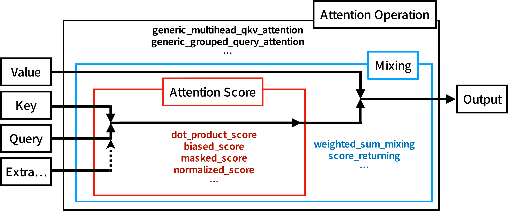

# NeuralAttentionlib.jl

Reusable functionality for defining custom attention/transformer layers. See [document](https://chengchingwen.github.io/NeuralAttentionlib.jl/dev) for more information.

# Design

 </img>

The core idea of this package is to make the attention operation composable, so that most of the attention variants can
 be easily defined without rewriting other parts. For example, normal attention use `softmax` on the attention score to
 normalize weight of each entries. If you want to replace `softmax` with other normalization function, such as L2-norm,
 there is a problem that they require different ways to mask specific entries such as paddings. With this package, we
 can easily do this by providing a different `AbstractMaskOp` to `masked_score`, so no copy-paste is needed. For another
 example, some position embeddings are adding values to the attention scores, with this package, you can directly chain
 the position embedding function (or use `biased_score`) with other score functions. Moreover, the same definition can
 be used directly for high dimensional attentions, such as image or video.

This package contain 3 submodules: `Matmul`, `Masks`, and `Functional`.

1. `Matmul` defines an Array wrapper `CollapsedDimsArray{T}(array, ni::Integer, nj::Integer)` which treat n-dimensional
 array as 3-dimensional array while preserving the original shape. By explicitly specifying which dimensions should be
 the "batch" and "length" dimensions, the implementations of attention do not need to worry about the input dimensions.
2. `Masks` provides an interface to define non-allocating masks with support for both CPU and GPU (using Julia's
 broadcast interface) and many pre-defined masks. For example, `CausalMask()` is just a Julia object and it would
 NOT allocate a `n^2` attention score mask either on CPU or GPU. These masks are also composable, you can use `&`/`|`
 to combine, for example, causal mask and padding mask without extra allocation or the need to write extra code.
3. `Functional` contains the implementation for the "attention score"s, "mixing"s, and "attention operation"s. The
 interface of "attention score"s allow you to chain different score function together, such as `normalized_score`,
 `masked_score`, and `biased_score`. And the interface of "attention operation"s allow you to provide different
 score functions and mixing functions. The other part, such as reshaping for multi-head, are automatically handled.
